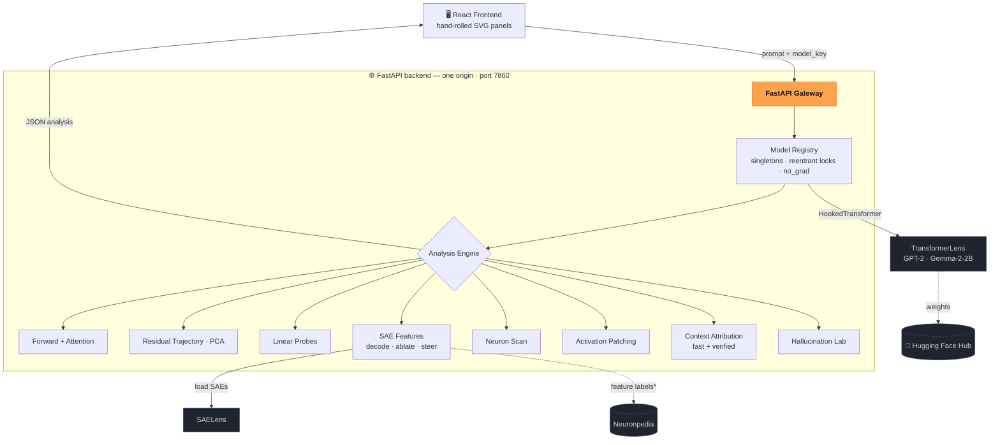
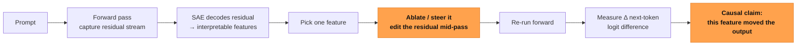

<div align="center">

# 🔬 GlassBox

### Watch a language model think — then reach in and change its mind.

A browser-based microscope for transformer LLMs. See every attention head, the residual stream, and the sparse features a model is using — then **ablate one feature and watch the answer move.** Causal, live, no setup.

[](https://numero00-glassbox-interp.hf.space)


**[Live Demo](https://numero00-glassbox-interp.hf.space)** · **[Quickstart](#-quickstart)** · **[Architecture](#-architecture)** · **[API](#-api)** · **[Report a bug](https://github.com/santoshcheethiralame-dot/GlassBox/issues)**

</div>

<!-- Drop a screen-recording or screenshot of the dashboard here for the hero shot:
        (a 15–25s GIF of ablating a feature works best) -->

---

## 🎬 The "aha"

Give **Gemma-2-2B** a false fact — *"The Brandenburg Gate is in Bengaluru"* — and it ignores you and answers from memory. A clean little hallucination.

GlassBox opens the model up, decodes its internal state into interpretable **features**, finds the one lighting up on *"political parties & events,"* and **switches it off**. The model's answer shifts measurably back toward the context you gave it — the grounded-vs-memorized gap moves from **−9.2 to −4.4 (+4.8), roughly halved.**

**One feature. One lever on one hallucination. Cause, not correlation.** That's the whole idea — and you can do the same thing (on GPT-2) in your browser right now: **[try it →](https://numero00-glassbox-interp.hf.space)**

---

## ✨ Highlights

- **See the model think** — every one of the 144 attention heads, the residual stream as a PCA trajectory, and the live next-token distribution.
- **Decode the hidden state** — a sparse autoencoder resolves the residual stream into 24K+ interpretable, labeled features.
- **Edit a thought, causally** — ablate or steer a feature *mid-forward-pass* and watch the next-token odds move.
- **Localize a fact** — activation patching pins where in (layer, token) a fact is stored; context attribution scores it two independent ways that cross-check.
- **Catch it hallucinating** — a knowledge-conflict lab that pits in-context truth against memorized knowledge, and suppresses a confabulation by ablating a single feature.
- **Zero setup** — GPT-2 runs on CPU in the browser; the same dashboard drives Gemma-2-2B on a GPU.
- **No black-box charts** — every visualization is hand-rolled inline SVG (no charting library).

---

## 📑 Table of Contents

- [The "aha"](#-the-aha) · [Highlights](#-highlights)
- [Architecture](#-architecture)
- [Quickstart](#-quickstart)
- [The panels](#-the-panels)
- [What it surfaces](#-what-it-surfaces)
- [Models](#-models)
- [API](#-api)
- [How it's built (design notes)](#-how-its-built-design-notes)
- [Roadmap](#-roadmap) · [Contributing](#-contributing) · [License](#-license) · [Acknowledgments](#-acknowledgments)

---

## 🏗 Architecture

One FastAPI process serves both the API and the built React bundle (one origin, port 7860). The backend wraps the models in TransformerLens and turns every internal signal into JSON.



<sub>*Outbound Neuronpedia label fetches are disabled on the public deployment (`GLASSBOX_NO_EXTERNAL`); the in-app "open on Neuronpedia" links still work from your browser.*</sub>

**The signature move — a causal feature intervention:**



---

## 🚀 Quickstart

**Easiest:** just open the **[live demo](https://numero00-glassbox-interp.hf.space)** — GPT-2, in the browser, no signup.

**Run it locally** (two processes: API on `:8000`, Vite dev server on `:5173` which proxies `/api` to the backend):

```bash
# 1) Backend
cd backend
python -m venv .venv && . .venv/bin/activate      # Windows: .venv\Scripts\Activate.ps1
pip install -r requirements.txt
uvicorn main:app --reload --port 8000              # first run downloads GPT-2 + the SAEs
```

```bash
# 2) Frontend (new terminal)
cd frontend
npm install
npm run dev                                        # open http://localhost:5173
```

**Run the whole thing as one container** (exactly what's deployed):

```bash
docker build -t glassbox .
docker run -p 7860:7860 glassbox                   # open http://localhost:7860
```

**Drive Gemma-2-2B (needs a GPU):** the free Space is CPU-only, so it serves GPT-2. To run the 2B model, use a notebook that builds this same app and serves it behind a public URL — see [`colab/`](colab/) (`glassbox.ipynb` for Colab T4, `glassbox_kaggle.ipynb` for Kaggle T4×2, which has the RAM to load Gemma comfortably). Accept the [gemma-2-2b-it](https://huggingface.co/google/gemma-2-2b-it) license with the same account as your HF token.

---

## 🕹 The panels

The dashboard is staged as five **acts** — passive observation → active intervention → a causal experiment that ties it together.

| Act | Panel | What it does |
|---|---|---|
| **Observe** | Tokenization + top-k | The forward pass and the live next-token distribution. |
| | Attention | All 144 head patterns as small multiples + a labeled detail view with the causal mask drawn explicitly. |
| | Residual trajectory | Each token's path through layer-space, PCA'd to 2D (on L2-normalized residuals). |
| | Probes | Per-layer logistic-regression probes — watch a concept become linearly readable across depth. |
| **Decode** | SAE features | A sparse autoencoder decomposes the residual stream into labeled, interpretable features. |
| | Neurons | The most selective MLP neurons and their maximally-activating contexts. |
| **Intervene** | Ablate / steer | Remove a feature from the residual stream, or amplify it along its decoder direction, and watch the output shift. |
| **Causal** | Activation patching | Copy clean activations into a corrupted run to localize *where* a fact lives. |
| | Context attribution | Score every input token's causal effect — a fast gradient path and a verified patching path that agree. |
| **Experiment** | Hallucination lab | Knowledge-conflict prompts (grounded vs confabulated) + the single-feature ablation that suppresses a confabulation. |

---

## 🧪 What it surfaces

Real results, all reproducible in the app:

- **Causal localization.** For `The capital of France is`, patching pins the answer to the **` France` token at layer 0**; the logit-difference swings **+1.89 (clean) → −2.81 (corrupted)**.
- **The Gemma flip.** Ablating one SAE feature moves a Brandenburg-Gate confabulation's grounded−memorized logit-diff **−9.2 → −4.4 (+4.8)** — roughly halved. (GPT-2, by contrast, *follows* 5 of 6 of the same false contexts; Gemma only 1 of 6.)
- **Features form across depth.** A **subject-number** probe (read past a distractor) starts *below chance* — early layers grab the wrong noun — then resolves to ~1.0 **by layer 3**.
- **A monosemantic neuron.** Layer 0, neuron **1133** is a clean *they / their* detector.

---

## 🧠 Models

| | GPT-2 small | Gemma-2-2B-it |
|---|---|---|
| Params | ~124M | ~2.6B |
| Layers × heads | 12 × 12 | 26 · GQA |
| d_model | 768 | 2304 |
| Runs on | CPU (default) | GPU |
| SAEs | `gpt2-small-res-jb` (~24K features, `resid_pre`) | Gemma Scope (~16K, `resid_post`) |

Gemma is GPU-gated: it's only offered by the model selector when a GPU is present, so the CPU deployment never tries to load it. Gemma Scope is trained on the *base* model and applied here to the *instruct* model — a deliberate, labeled approximation the SAE panel flags.

---

## 🔌 API

All routes are under `/api`.

| Method | Route | Returns |
|---|---|---|
| `GET` | `/health` · `/models` | model dims · available (GPU-gated) models |
| `POST` | `/forward` | tokens, top-k predictions, attention |
| `POST` | `/trajectory` | per-token 2D PCA coordinates per layer |
| `POST` | `/patch` | activation-patching restoration `scores[layer][pos]` |
| `GET/POST` | `/sae/info` · `/sae/features` | SAE metadata · top features per token, labeled |
| `POST` | `/sae/intervene` | baseline vs ablated/steered top-k + logit deltas |
| `POST` | `/attribute` | per-token causal scores (fast + verified) |
| `POST` | `/experiment` | grounded/confabulated rows + the ablation flip |
| `POST` | `/probe` · `GET` `/probe/concepts` | per-layer probe accuracy · available concepts |
| `GET` | `/neuron/scan` · `/neuron` | most selective neurons · one neuron's contexts |

---

## 🔩 How it's built (design notes)

A few decisions that aren't obvious from the code:

- **One model per key, behind a reentrant lock, under `no_grad`.** TransformerLens caches activations by mutating hook state and the dashboard fires several requests at once, so the forward passes are serialized per model. PyTorch's grad flag is thread-local (FastAPI uses a thread pool), so handlers force `no_grad`; attribution re-enables it locally — hence *reentrant*.
- **Attribution uses a counterfactual pair, not one prompt.** A clean/corrupted pair with a logit-difference metric makes the fast (gradient) and verified (patching) paths line up almost exactly — a built-in correctness check.
- **PCA on L2-normalized residuals.** Residual norm grows with depth; without normalizing, PC1 is just "how deep are we" and the trajectory is a straight slide.
- **Probes split by source word.** `StratifiedGroupKFold` grouped on the word stops the probe from memorizing token identity (which would score every layer ~100%).
- **Charts hand-rolled in SVG.** Full control over the look, a tiny bundle, and the custom layouts (144-head small-multiples, layer-space trajectories) that a generic charting library would fight.

---

## 🗺 Roadmap

- [ ] SAE feature **search** across a corpus (find the feature for a concept, not just per-token).
- [ ] **Circuit discovery** — chain patched components into a subgraph.
- [ ] Attention-head attribution to specific behaviors.
- [ ] Batched backend inference (turn the serialized-per-model server into a real inference service).
- [ ] Persist/share an analysis via URL.

---

## 🤝 Contributing

Issues and PRs welcome. To get set up, follow [Quickstart](#-quickstart); the backend is `backend/` (FastAPI + TransformerLens) and the frontend is `frontend/` (React + Vite, one panel per component). Open an issue to discuss anything substantial before a large PR.

---

## 📄 License

See [`LICENSE`](LICENSE).

---

## 🙏 Acknowledgments

Built on the shoulders of [**TransformerLens**](https://github.com/TransformerLensOrg/TransformerLens) and [**SAELens**](https://github.com/jbloomAus/SAELens) for model internals, the **gpt2-small-res-jb** SAEs and Google's [**Gemma Scope**](https://ai.google.dev/gemma/docs/gemma_scope) for the features, and [**Neuronpedia**](https://www.neuronpedia.org) for feature labels. Models: OpenAI's **GPT-2** and Google's **Gemma-2-2B**.
